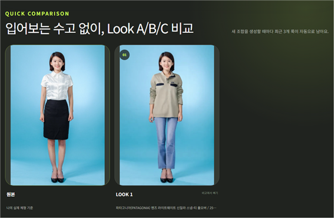
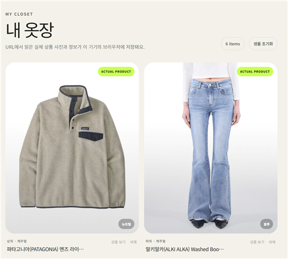

# Wearly

쇼핑몰 상품 URL을 붙여 넣으면 상품 정보를 내 옷장에 추가하고, 내 전신사진에 실제 상품을 입혀 여러 코디를 비교하는 서비스입니다.

### Live Demo

👉[Wearly 바로 사용해보기](https://wearly-ai-closet.vercel.app/)

## 서비스 화면

### 입어보는 수고 없이, Look 비교

원본 전신사진과 선택한 옷을 적용한 결과를 나란히 확인하며 여러 코디를 빠르게 비교할 수 있습니다.



### 내 옷장

쇼핑몰 URL에서 가져온 실제 상품사진과 정보를 옷장에 저장하고, 코디 추천과 가상 피팅에 바로 활용할 수 있습니다.



## 포함된 기능

- 상품 URL 붙여넣기 및 클립보드 붙여넣기
- 공개 상품 페이지의 Open Graph/JSON-LD 정보 분석
- 상품 페이지의 실제 제품 사진을 옷장 카드에 반영
- 색상·카테고리·계절·스타일 자동 태깅
- 브라우저 `localStorage` 기반 개인 옷장 저장
- 도시 검색·현재 위치 기반 실시간 날씨 조회
- 체감온도·강수확률·바람과 학교·회사·데이트·면접·야외·여행 장소를 함께 반영한 자동 코디
- 자동 추천 코디를 실사 피팅 슬롯으로 바로 전달
- 정면 전신사진 속 실제 체형을 기준으로 한 실사 피팅
- 브라우저 내 MediaPipe 포즈 감지로 어깨·골반·무릎·발목 기준점 자동 분석
- 기존 의상을 지운 뒤 실제 상품사진을 반영하는 상의·하의·아우터·원피스 정밀 AI 피팅
- 여러 상품을 순서대로 합성하는 한 벌 코디 생성
- 원본과 최근 Look A/B/C를 나란히 보는 빠른 비교 보드
- 전신사진과 결과 이미지를 `localStorage`에 저장하지 않는 개인정보 분리
- 등교·데이트·면접·산책 상황별 코디 조합
- 모바일/데스크톱 반응형 화면
- 사설 주소, 위험한 리디렉션, 과도한 응답 크기 차단

## 로컬 실행

```bash
npm install
npm run dev
```

실사 피팅은 FASHN VTON 1.5 공개 Hugging Face Space를 우선 사용하고 CatVTON을 생성형 보조 엔진으로 사용합니다. API 키와 결제 크레딧은 필요하지 않습니다. 두 공개 엔진이 모두 실패하면 원본 사진을 유지하고 오류를 안내하며, 실제 착용처럼 보이지 않는 2D 상품사진 합성으로 자동 전환하지 않습니다.

사진을 올리면 함께 포함된 MediaPipe Pose Landmarker가 브라우저 안에서 전신 기준점과 사람 실루엣을 확인합니다. 실제 결과는 생성형 VTON이 원래 얼굴과 자세를 기준으로 기존 의상을 교체하고 허리선·가랑이·다리 윤곽·주름을 새로 생성합니다. 상품사진은 모델 착용컷과 단독 상품컷을 자동 구분해 해당 전처리 모드로 전달합니다. 모델과 WASM 파일은 `public/models`, `public/mediapipe`에 포함되어 있어 별도 키나 외부 모델 다운로드가 필요하지 않습니다.

현재 생성 범위는 상의·하의·아우터·원피스입니다. 신발은 아직 생성 대상이 아니므로 원본 신발을 유지합니다.

가상 피팅은 정밀 실사 생성 한 가지 모드만 제공합니다. 기존 의상을 마스킹하고 40단계로 새 옷의 형태와 주름을 생성합니다.

날씨는 API 키가 필요 없는 Open-Meteo Forecast/Geocoding API를 사용합니다. 서울·부산·제주 등 주요 국내 도시는 한글 이름으로 바로 찾고, 현재 위치도 지원합니다.

브라우저에서 `http://localhost:3000`을 엽니다.

## 검증

```bash
npm run lint
npm run build
```

## 배포

**[Wearly 바로 사용해보기](https://wearly-ai-closet.vercel.app/)**

Vercel을 통해 배포된 서비스입니다.

## ⚠️ 참고사항

일부 쇼핑몰은 봇 접근이나 외부 이미지 로딩을 제한하고 있어 상품의 상세 정보나 이미지를 가져오지 못하는 경우가 있습니다. 이때는 URL에서 확인할 수 있는 상품 정보와 색상을 바탕으로 한 대체 이미지가 표시됩니다. 실제 상품 이미지가 없는 경우에는 실사 피팅을 이용할 수 없습니다.

전신 사진과 상품 사진의 상태, 옷이 겹쳐 있는 정도, 생성 모델의 특성에 따라 결과가 달라질 수 있습니다. 실제 옷의 사이즈나 착용감을 보장하거나 구매 적합성을 판단하는 기능은 포함되어 있지 않습니다.

자동 코디 기능은 현재 옷장에 저장된 카테고리·)

자동 코디는 현재 옷장에 저장된 카테고리, 스타일, 계절, 색상 정보를 바탕으로 어울리는 옷을 추천합니다. 날씨 정보를 불러오지 못하는 경우에는 기본 간절기 기준으로 코디를 추천합니다.

자동 코디 기능은 현재 옷장에 저장된 카테고리·스타일·계절·색상 정보를 점수화하는 MVP 추천 방식입니다. 날씨 데이터가 일시적으로 이용 불가능한 경우에도 기본 간절기 기준으로 추천을 제공합니다.
